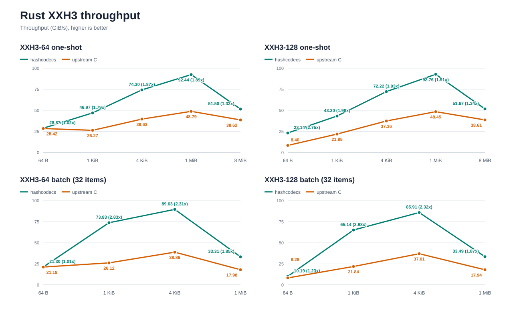
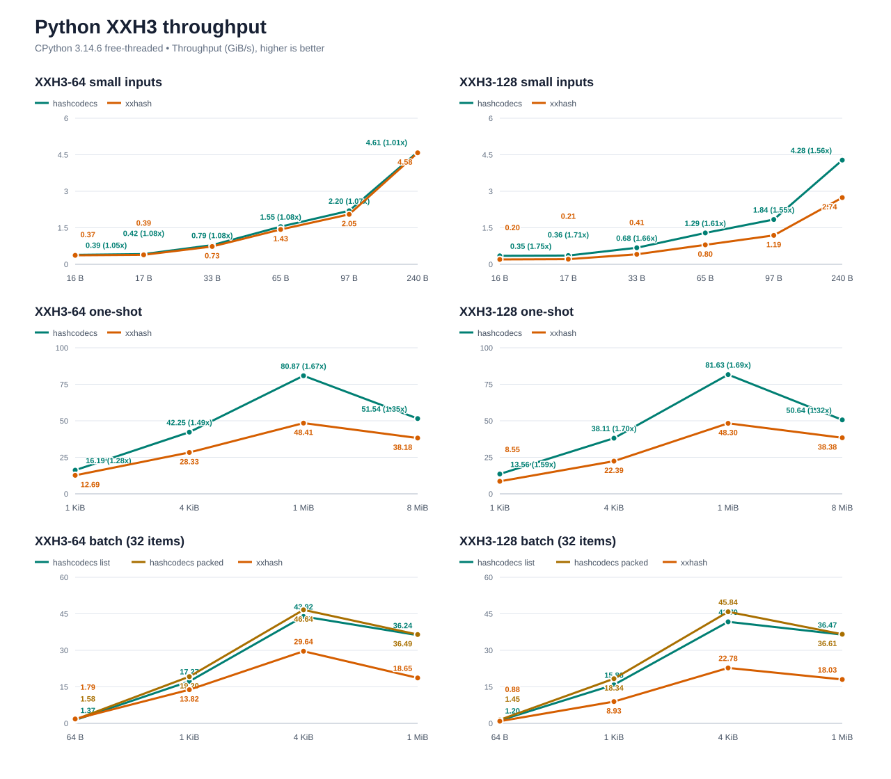
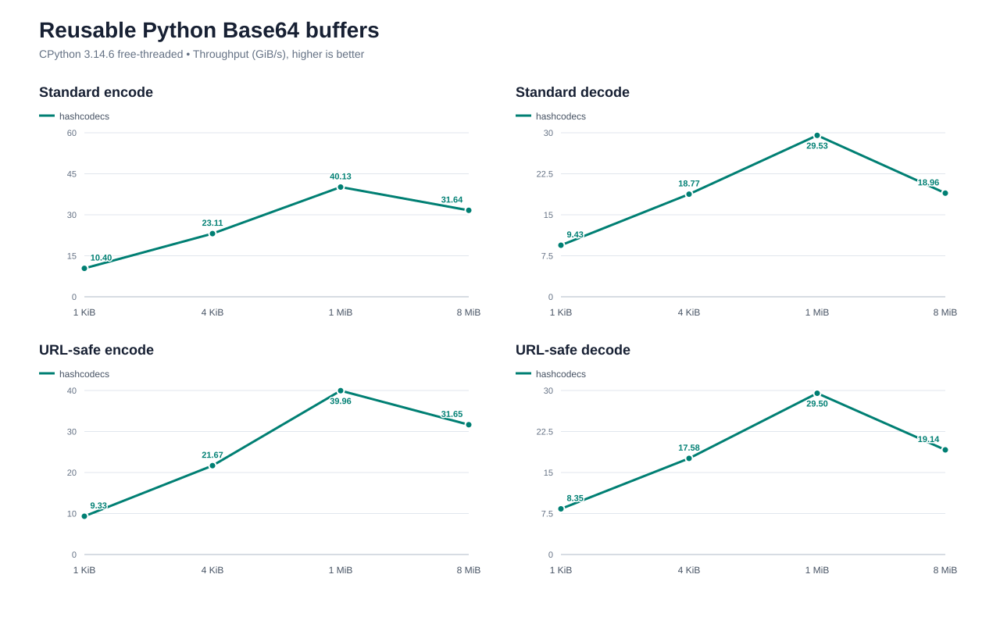
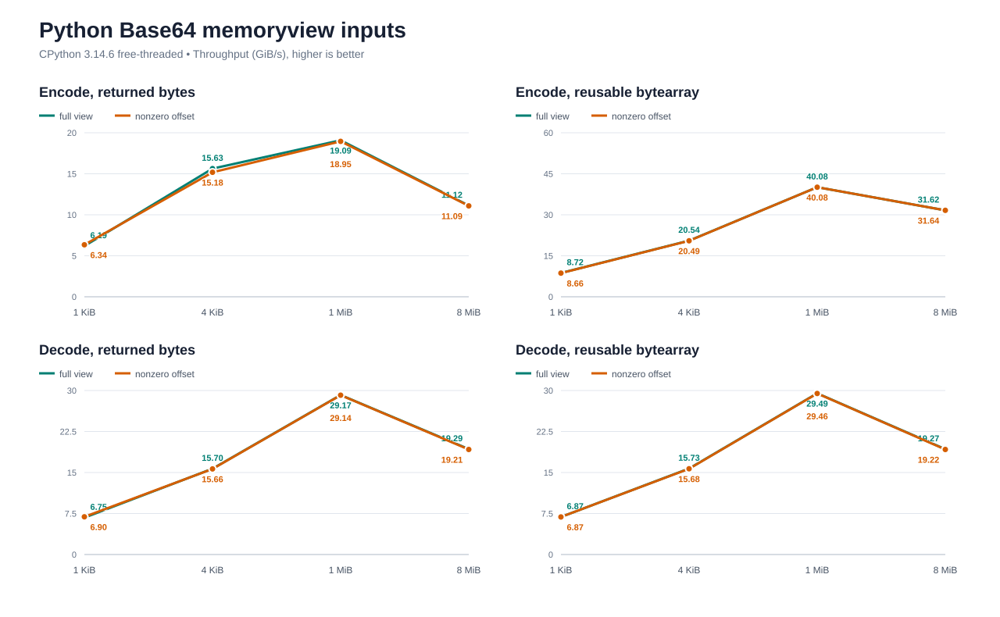
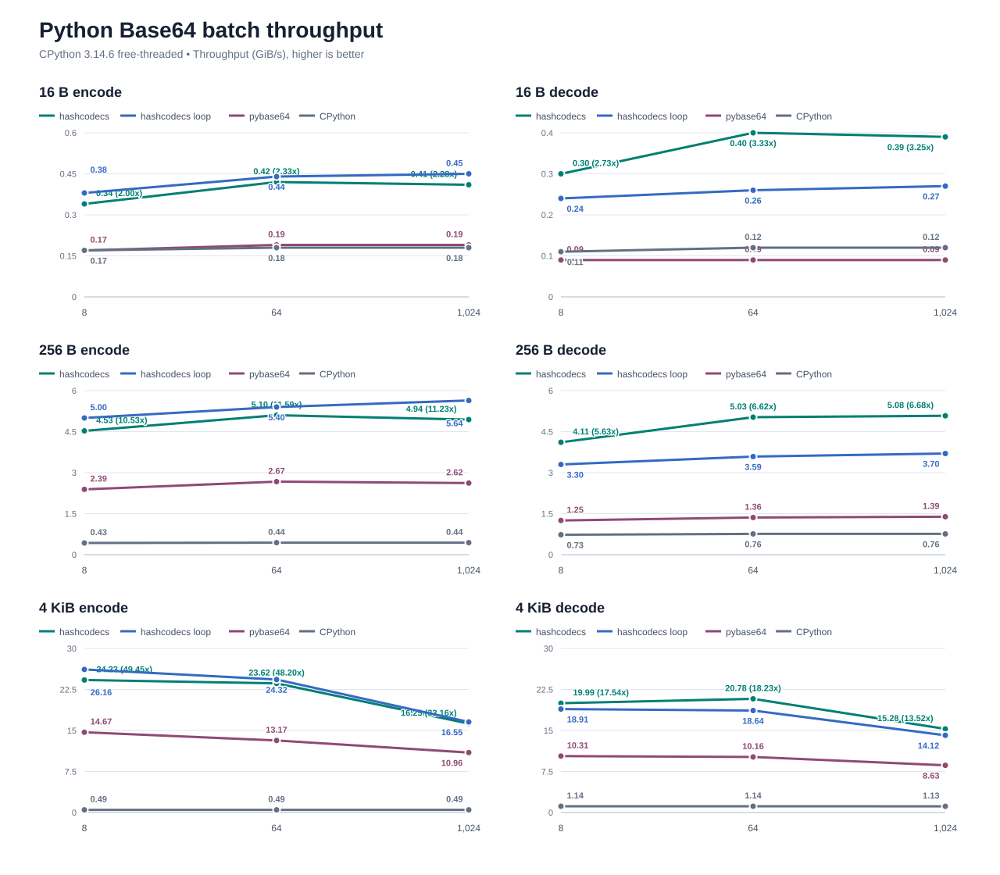
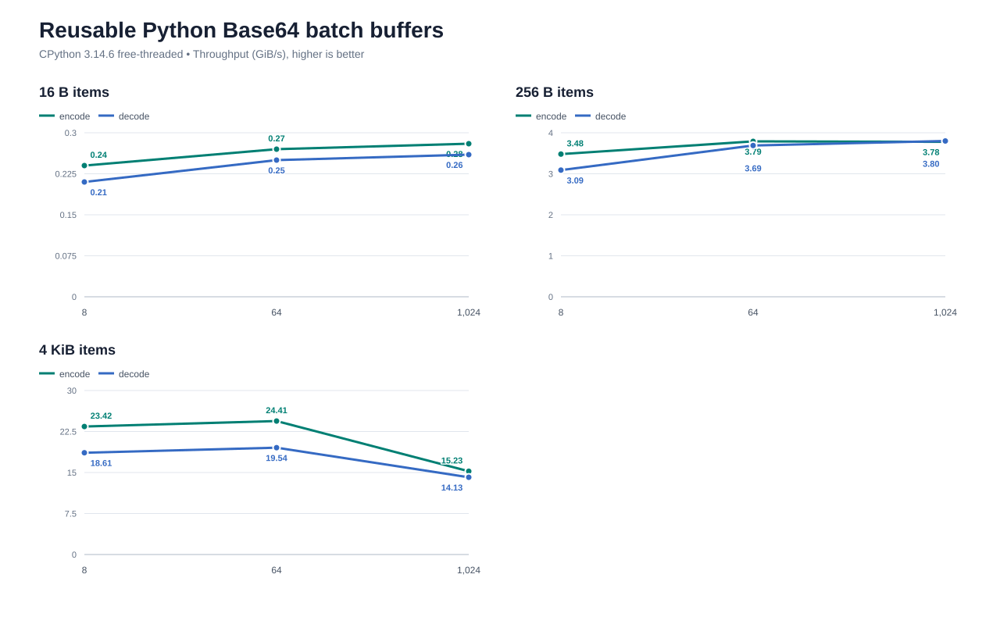
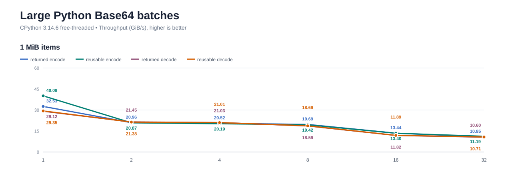
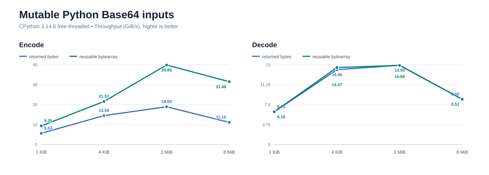
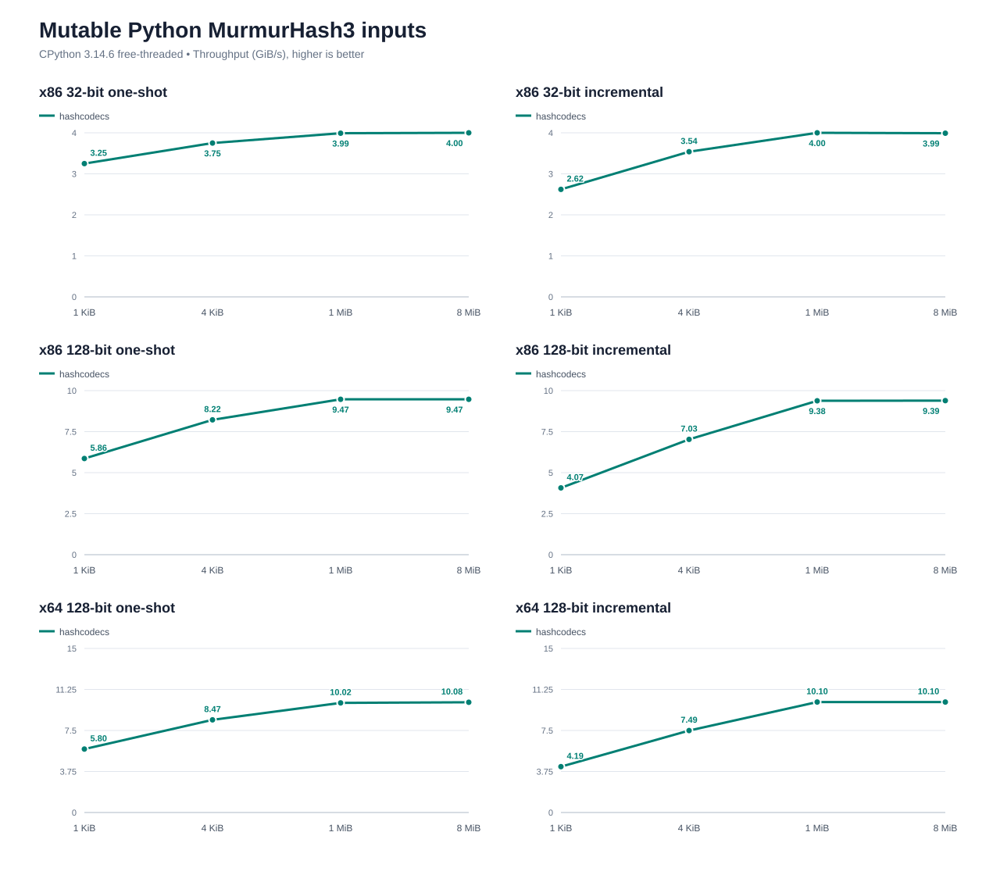

# Benchmark Details

Environment: Windows 10 x64 and Intel Core Ultra 7 265K.

Conditions: clean builds, one pinned logical CPU, single-threaded execution, and 15 Python samples. The upstream C baseline was compiled explicitly for AVX2, matching the backend selected by hashcodecs on this host. Higher is better.

The charts are generated by `uv run python benchmarks/render_charts.py`. Their exact measurements are available in
[CSV form](docs/benchmarks/results.csv).

## XXH3

The Rust comparison calls xxHash 0.8.3 through `xxhash-c-sys`. Python compares with the upstream `xxhash` extension.
Batch measurements contain 32 equal-size inputs.

## Reusable Python Buffers

## Python Memoryview Inputs

Full immutable memoryviews reuse their underlying bytes for inputs of at least 64 KiB.

## Python Base64 Batches

The horizontal axis is the batch size and the vertical axis is total input throughput.

## Reusable Python Base64 Batch Buffers

These measurements use the `*_batch_into` APIs with one reusable `bytearray` per item.

## Large Python Base64 Batches

Each batch item is 1 MiB. The horizontal axis is the batch size.

## Mutable Python Inputs

### Base64

### MurmurHash3

