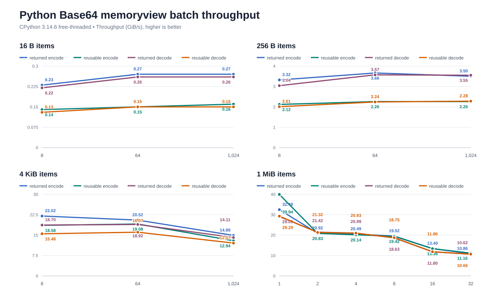

# Benchmark Details

Run the suite on Windows 10 x64 with an Intel Core Ultra 7 265K.

Pin one logical CPU. Run each case in one thread. Collect 50 Rust samples and 15 Python samples. Compile the C
baseline with AVX2, the backend that hashcodecs selects on this host. Higher throughput wins.

Build the Python wheel with CPython 3.12 and the full C API. Keep competitor values from the latest comparison run.
Use `uv run --python 3.12 --no-project python benchmarks/render_charts.py` to render the charts. Read exact values in
[docs/benchmarks/results.csv](docs/benchmarks/results.csv).

The standard and URL-safe Python decode panels report CPython 3.12.10 measurements from 2026-09-09. In the lenient
decode chart, the custom `@#` panels report measurements from 2026-09-12; the standard MIME and noisy panels retain
their 2026-09-05 measurements. Each value is the median of 15 samples lasting at least 0.2 seconds each, with one
logical CPU pinned.

## Timing Controls

Every Python benchmark accepts `--samples` (default: 15) and `--minimum-sample-seconds` (default: 0.2). Their
sampling time per case is at least their product, plus calibration; use lower values only for exploratory runs. For a quicker full
hashcodecs-only pass, use `--hashcodecs-only --samples 3 --minimum-sample-seconds 0.05` with each Python benchmark
script.

Each Rust Criterion harness collects 50 samples per case. Pass Criterion's `--sample-size` option for an exploratory
run with a different count.

## Python Call Costs

Run `python benchmarks/python_calls.py` to measure positional calls from 0 through 256 bytes in nanoseconds per
call. Use `--keywords` for positional and keyword calls at 64 bytes, or `--thresholds` for latency around the
GIL-detachment cutoffs. The `--thread-scaling` mode measures aggregate throughput with one, two, and four threads;
it does not pin the process to one logical CPU. Use `--buffer-inputs` to compare 64-byte and 4 KiB XXH3-64 calls
across bytes, full and sliced memoryviews, writable and non-contiguous views, and `array('B')`.

## Rust MurmurHash3 x64 Dispatch

Use scalar below 512 bytes of full blocks, then AVX2 when available. The SSE4.1 fallback starts at 512 bytes
and retains its 8 MiB upper limit. Incremental updates apply these thresholds to each batch of full blocks.

Forced-backend measurements with complete finalization on the Core Ultra 7 265K put scalar and AVX2 near parity
at 384 bytes (39.99 and 40.20 ns/hash), with AVX2 ahead at 512 bytes (53.98 and 52.76 ns/hash). Use 512 bytes as
a crossover candidate for this host. The shared minimum also avoids the measured SSE4.1 overhead on small inputs;
it does not establish an SSE4.1 crossover or an optimum across Intel and AMD CPUs.

The following public Rust API measurements include runtime dispatch and finalization. On 2026-09-13, we collected
50 Criterion samples per case with one logical CPU pinned, a 300 ms warmup, and a 1 s measurement target. These
values report Criterion's mean estimate with seed 42; they are separate from the forced-backend measurements.

| Input | ns/hash |
| --- | ---: |
| 15 B | 5.32 |
| 16 B | 5.47 |
| 31 B | 5.89 |
| 32 B | 6.03 |
| 64 B | 7.80 |
| 255 B | 24.42 |
| 256 B | 25.04 |
| 384 B | 37.93 |
| 511 B | 50.35 |
| 512 B | 49.79 |
| 513 B | 50.43 |
| 1 KiB | 96.89 |

We refreshed the x64 hashcodecs series in the Rust MurmurHash3 throughput chart on the same date, retaining the
x86 and competitor measurements from the previous comparison run.

```sh
cargo bench --manifest-path benches/Cargo.toml --bench crossover -- murmur_x64_128_crossover
cargo bench --manifest-path benches/Cargo.toml --bench murmur3 -- x64_128/hashcodecs
```

## XXH3

For the Rust comparison, link hashcodecs with xxHash 0.8.3 through `xxhash-c-sys`. Build the C baseline with AVX2.
For Python, run the upstream `xxhash` extension beside hashcodecs. Pass 32 equal-size inputs to each batch case.
The Rust remainder cases pass two or three equal-size long inputs. Run Python remainder cases with
`python benchmarks/python_xxhash.py --batch-counts 2 3`.

To measure a branch against its parent, build both extensions with the same Python and Rust toolchains, then run:

```sh
uv run --frozen --no-sync python benchmarks/compare_xxh3_batches.py path/to/parent/_hashcodecs.pyd path/to/branch/_hashcodecs.pyd
```

Use the corresponding `.so` paths on Linux or macOS. The comparison loads both builds into one interpreter, pins
one CPU, and alternates their timing order across 15 samples. It checks matching digests and covers bytes,
bytearrays, and writable memoryviews. Use `--batch-counts 2 9 32 33 --sizes 64` to inspect small batches and the
32-result stack boundary. Positive `change_percent` values mean higher branch throughput.

The [32-item parent comparison](docs/benchmarks/xxh3-batch-parent-comparison.csv) records CPython 3.12.10 results
against parent commit `f17ab86`, measured on 2026-09-05. These paired measurements also cover the 256 KiB
GIL-detachment threshold and 1 MiB items. The Python XXH3 batch panels report CPython 3.12.10 measurements
from 2026-09-13, using 15 samples of at least 0.2 seconds; one-shot and upstream values retain their prior measurements.

Across the 30 paired 32-item cases, branch throughput ranges from 2.59% lower to 2.70% higher than the parent.
The [stack-boundary comparison](docs/benchmarks/xxh3-batch-boundary-comparison.csv) covers counts 2 and 33 with
64-byte items: two-item bytearray batches lose 5.40–6.05%, and 33-item bytes batches lose 6.06–7.05%. These
measurements show residual overhead for some small-input batches; they do not establish zero regression.

### Packed-batch detachment

XXH3 batches release the GIL at 1 MiB of total input or 16,384 items, provided the input buffers permit detachment.
The item limit accounts for per-item hashing and output work, including empty inputs. One-shot XXH3 keeps its
256 KiB threshold. Mutable inputs retain their existing synchronization rules.

The detached packed path retains input owners, borrows 64 inputs at a time on the stack, and stages results until
it reacquires the GIL and rechecks the output size. This removes one allocation and 16 bytes of temporary input
descriptors per item on 64-bit hosts. Little-endian hosts copy staged results in one operation.

The [candidate measurements](docs/benchmarks/xxh3-packed-candidates.csv) compare 256 KiB, 512 KiB, and 1 MiB
byte thresholds with the same allocation reduction and 16,384-item limit. Each exploratory value uses five
samples of at least 0.03 seconds. The 1 MiB policy keeps both 4,096- and 8,192-item batches of 64-byte inputs on
the direct-output path. This trades longer GIL holds for lower latency; it does not establish an optimal threshold
for other processors or contended workloads.

The [selected-policy measurements](docs/benchmarks/xxh3-packed-thresholds.csv) use CPython 3.15.0b4 on the
Intel Core Ultra 7 265K, with one logical CPU pinned, independent input allocations, and 15 samples of at least
0.2 seconds each, measured on 2026-09-13. They cover both digest widths and item sizes of 64 bytes, 1 KiB, and 64 KiB.
For 64-byte inputs:

| Items | XXH3-64 packed latency | XXH3-128 packed latency |
| ---: | ---: | ---: |
| 4,095 | 13.92 µs | 27.29 µs |
| 4,096 | 14.48 µs | 27.33 µs |
| 4,097 | 13.95 µs | 27.44 µs |
| 8,191 | 28.95 µs | 54.72 µs |
| 8,192 | 29.14 µs | 54.61 µs |
| 8,193 | 29.46 µs | 54.57 µs |
| 16,383 | 58.49 µs | 109.12 µs |
| 16,384 | 92.78 µs | 144.04 µs |
| 16,385 | 94.52 µs | 145.62 µs |

A discontinuity remains at the new detachment boundary because retaining owners and staging output still cost work.
The longest measured attached call near these boundaries takes about 109 microseconds. This is a latency
measurement on this host, not a bound on thread waiting time; the tests also verify GIL progress for large inputs
and for 16,384-item batches of empty, one-byte, and 64-byte inputs.

```sh
uv run --frozen --no-sync python benchmarks/python_xxhash_thresholds.py --output docs/benchmarks/xxh3-packed-thresholds.csv
uv run --frozen --no-sync python benchmarks/python_xxhash.py --batches-only --hashcodecs-only
```

`--thresholds-kib` selects benchmark input sizes around each candidate; it does not change the extension's
compiled policy. To compare candidates, rebuild the wheel after changing `BATCH_DETACH_BYTES` in
`src/bindings/xxhash/batch.rs`.

The Rust mixed benchmarks use `[1024, 1024, 4096, 4096]`, `[257, 258, 259, 260]`, `[240, 240, 241, 241]`, and the
reverse boundary order. The 1024/4096 case measures adjacent two-item long runs. The 257–260 case measures a
four-item run with one shared stripe count and distinct final stripes. The 240/241 cases measure both orders across
the short/long dispatch boundary.

Use the focused one-shot run to cover the AVX2 four-chain boundaries:

```sh
cargo bench --manifest-path benches/Cargo.toml --bench xxhash -- "xxh3_(64|128)/(240|241|512|768|1024|1536|2048|4096)/hashcodecs"
cargo bench --manifest-path benches/Cargo.toml --bench xxhash -- "xxh3_batch/mixed/.*/hashcodecs_(64|128)"
cargo bench --manifest-path benches/Cargo.toml --bench xxhash -- "xxh3_prepared"
```

[](docs/benchmarks/xxh3-rust.svg)

[](docs/benchmarks/xxh3-rust-batch-remainders.svg)

[](docs/benchmarks/xxh3-python.svg)

## Reusable Python Buffers

Pass one reusable `bytearray` to each `*_into` call.

[](docs/benchmarks/base64-python-reusable.svg)

## Lenient Python Base64

Run `python benchmarks/python_base64.py --lenient`. The MIME cases insert CRLF after each 76-character line. The
noisy cases insert `!` at the same boundaries. Both cases measure returned bytes and reusable output buffers.

Run `uv run --no-project --python 3.12 python benchmarks/python_base64.py --custom-lenient` to measure clean and noisy
inputs with `@#` altchars. For a 1 MiB decoded payload, the custom clean case reaches 3.44 GiB/s with returned bytes
and 13.05 GiB/s with a reusable output buffer. The decoder translates complete symbol runs in a 4 KiB staging buffer
for SIMD decoding and handles padding and ignored characters through the lenient state machine.

[](docs/benchmarks/base64-python-lenient.svg)

## Wrapped Python Base64

Run `python benchmarks/python_base64.py --wrapped` with CPython 3.15 or newer. The benchmark inserts newlines after
76 output characters and measures returned bytes and a reusable `bytearray`.

## Python Memoryview Inputs

Use `--memoryview-input` for full immutable views and `--sliced-memoryview-input` for equal-length contiguous views
with a nonzero starting offset. Full views can recover their exact immutable owner at detachment sizes; slices cover
offset-buffer handling, which borrows under the GIL and stabilizes the input in free-threaded builds. The encoded data
remains identical.

[](docs/benchmarks/base64-python-memoryview.svg)

## Python Base64 Batches

Set the horizontal axis to batch size. Read total input throughput on the vertical axis.

[](docs/benchmarks/base64-python-batch.svg)

For focused runs, override the item and batch sizes directly. `--decode-only` avoids carrying encode allocator state
into a decode investigation:

```sh
python benchmarks/python_base64_batch.py --item-sizes 4096 --batch-sizes 512 768 1024 1280 2048 --decode-only
```

Add `--memoryview-input` to wrap every matrix input in an exact memoryview. This mode compares independent views
against the matching one-item loops and reusable-output paths.

[](docs/benchmarks/base64-python-batch-memoryview.svg)

```sh
python benchmarks/python_base64_batch.py --item-sizes 1048576 --batch-sizes 8 --memoryview-input --decode-only
```

Use a single operation when recording a sampling profile, or compare traced allocations without a sampler:

```sh
python benchmarks/python_base64_batch.py --item-sizes 4096 --batch-sizes 1024 --profile-operation returned
python benchmarks/python_base64_batch.py --item-sizes 4096 --batch-sizes 1024 --allocation-profile
```

Add `--profile-direction encode` for returned encoding. By default, the profiling loop assigns the next result
before releasing the previous one. Add `--discard-profile-result` to release each result before the next call. Use
`b64encode_batch_into` for that workload.

```sh
python benchmarks/python_base64_batch.py --item-sizes 4096 --batch-sizes 1024 --profile-direction encode --profile-operation returned
python benchmarks/python_base64_batch.py --item-sizes 4096 --batch-sizes 1024 --profile-direction encode --profile-operation returned --discard-profile-result
python benchmarks/python_base64_batch.py --item-sizes 4096 --batch-sizes 1024 --profile-direction encode --allocation-profile
```

## Reusable Python Base64 Batch Buffers

Pass one reusable `bytearray` to each item in the batch. Use the `*_batch_into` APIs.

[](docs/benchmarks/base64-python-batch-reusable.svg)

## Large Python Base64 Batches

Use 1 MiB for each batch item. Set the horizontal axis to batch size.

[](docs/benchmarks/base64-python-batch-large.svg)

## Mutable Python Inputs

### Base64

Pass `bytearray` inputs to the Base64 API.

[](docs/benchmarks/base64-python-mutable.svg)

### MurmurHash3

Pass `bytearray` inputs to the MurmurHash3 API.

[](docs/benchmarks/murmur3-python-mutable.svg)

## Reproduction

Run the benchmark

```
uv sync --python 3.12 --frozen --group benchmark --no-install-project

uv run --python 3.12 --refresh-package hashcodecs --no-project --with . --with mmh3==5.2.1 --with pybase64==1.4.3 --with xxhash==3.8.1 python benchmarks/python_base64.py --hashcodecs-only

uv run --python 3.12 --refresh-package hashcodecs --no-project --with . --with mmh3==5.2.1 --with pybase64==1.4.3 --with xxhash==3.8.1 python benchmarks/python_base64_batch.py --hashcodecs-only

uv run --python 3.12 --refresh-package hashcodecs --no-project --with . --with mmh3==5.2.1 --with pybase64==1.4.3 --with xxhash==3.8.1 python benchmarks/python_murmur3.py --hashcodecs-only

uv run --python 3.12 --refresh-package hashcodecs --no-project --with . --with mmh3==5.2.1 --with pybase64==1.4.3 --with xxhash==3.8.1 python benchmarks/python_murmur3.py --hashcodecs-only --incremental

uv run --python 3.12 --refresh-package hashcodecs --no-project --with . --with mmh3==5.2.1 --with pybase64==1.4.3 --with xxhash==3.8.1 python benchmarks/python_xxhash.py --hashcodecs-only
```

Update the documentation

```
uv run --python 3.12 --no-project python benchmarks/render_charts.py
```
