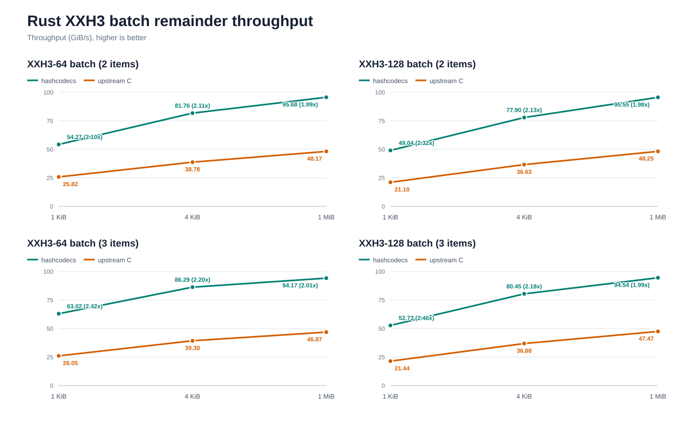
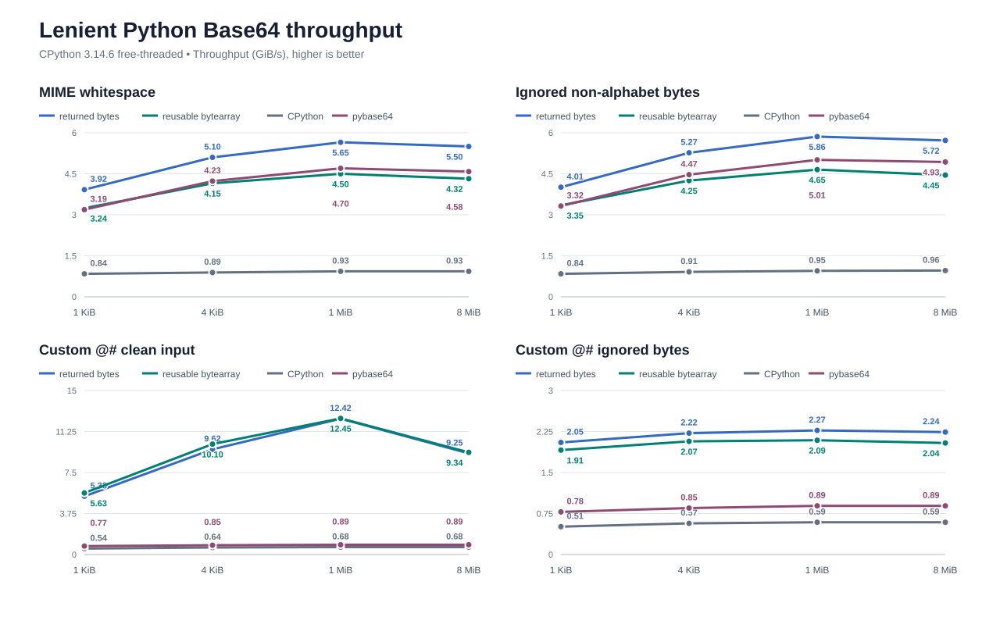

# Benchmark Details

Run the suite on Windows 10 x64 with an Intel Core Ultra 7 265K.

Pin one logical CPU. Run each case in one thread. Collect 50 Rust samples and 15 Python samples. Compile the C
baseline with AVX2, the backend that hashcodecs selects on this host. Higher throughput wins.

Build the Python wheel with CPython 3.12 and the full C API. Keep competitor values from the latest comparison run.
Use `uv run python benchmarks/render_charts.py` to render the charts. Read exact values in
[docs/benchmarks/results.csv](docs/benchmarks/results.csv).

## Timing Controls

Every Python benchmark accepts `--samples` (default: 15) and `--minimum-sample-seconds` (default: 0.2). Their
sampling time per case is at least their product, plus calibration; use lower values only for exploratory runs. For a quicker full
hashcodecs-only pass, use `--hashcodecs-only --samples 3 --minimum-sample-seconds 0.05` with each Python benchmark
script.

## Python Call Costs

Run `python benchmarks/python_calls.py` to measure positional calls from 0 through 256 bytes in nanoseconds per
call. Use `--keywords` for positional and keyword calls at 64 bytes, or `--thresholds` for latency around the
GIL-detachment cutoffs. The `--thread-scaling` mode measures aggregate throughput with one, two, and four threads;
it does not pin the process to one logical CPU.

## XXH3

For the Rust comparison, link hashcodecs with xxHash 0.8.3 through `xxhash-c-sys`. Build the C baseline with AVX2.
For Python, run the upstream `xxhash` extension beside hashcodecs. Pass 32 equal-size inputs to each batch case.
The Rust remainder cases pass two or three equal-size long inputs. Run Python remainder cases with
`python benchmarks/python_xxhash.py --batch-counts 2 3`.

Use the focused one-shot run to cover the AVX2 four-chain boundaries:

```sh
cargo bench --bench xxhash -- --sample-size 50 "xxh3_(64|128)/(241|512|768|1024|1536|2048|4096)/hashcodecs"
```

[](docs/benchmarks/xxh3-rust.svg)

[](docs/benchmarks/xxh3-rust-batch-remainders.svg)

[](docs/benchmarks/xxh3-python.svg)

## Reusable Python Buffers

Pass one reusable `bytearray` to each `*_into` call.

[](docs/benchmarks/base64-python-reusable.svg)

## Lenient Python Base64

Run `python benchmarks/python_base64.py --lenient`. The MIME cases insert CRLF after each 76-character line. The
noisy cases insert `!` at the same boundaries. Both cases measure returned bytes and reusable output buffers.

[](docs/benchmarks/base64-python-lenient.svg)

## Python Memoryview Inputs

Use full immutable memoryviews for inputs of at least 64 KiB.

[](docs/benchmarks/base64-python-memoryview.svg)

## Python Base64 Batches

Set the horizontal axis to batch size. Read total input throughput on the vertical axis.

[](docs/benchmarks/base64-python-batch.svg)

For focused runs, override the item and batch sizes directly. `--decode-only` avoids carrying encode allocator state
into a decode investigation:

```sh
python benchmarks/python_base64_batch.py --item-sizes 4096 --batch-sizes 512 768 1024 1280 2048 --decode-only
```

Use a single operation when recording a sampling profile, or compare traced allocations without a sampler:

```sh
python benchmarks/python_base64_batch.py --item-sizes 4096 --batch-sizes 1024 --profile-operation returned
python benchmarks/python_base64_batch.py --item-sizes 4096 --batch-sizes 1024 --allocation-profile
```

## Reusable Python Base64 Batch Buffers

Pass one reusable `bytearray` to each item in the batch. Use the `*_batch_into` APIs.

[](docs/benchmarks/base64-python-batch-reusable.svg)

## Large Python Base64 Batches

Use 1 MiB for each batch item. Set the horizontal axis to batch size.

[](docs/benchmarks/base64-python-batch-large.svg)

## Mutable Python Inputs

### Base64

Pass `bytearray` inputs to the Base64 API.

[](docs/benchmarks/base64-python-mutable.svg)

### MurmurHash3

Pass `bytearray` inputs to the MurmurHash3 API.

[](docs/benchmarks/murmur3-python-mutable.svg)
