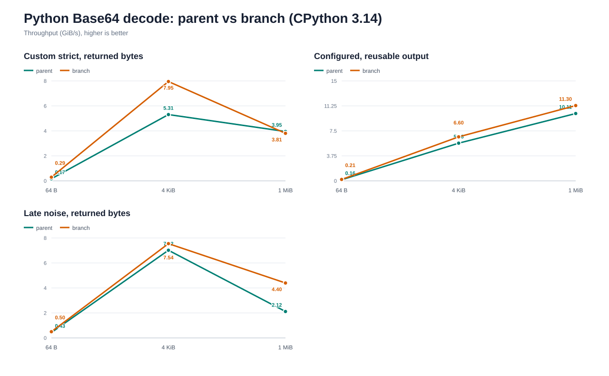

# Benchmark Details

Run the suite on Windows 10 x64 with an Intel Core Ultra 7 265K.

Pin one logical CPU. Run each case in one thread. Collect 50 Rust samples and 15 Python samples. Compile the C
baseline with AVX2, the backend that hashcodecs selects on this host. Higher throughput wins.

Build the Python wheel with CPython 3.12 and the full C API. Keep competitor values from the latest comparison run.
Use `uv run --python 3.12 --no-project python benchmarks/render_charts.py` to render the charts. Read exact values in
[docs/benchmarks/results.csv](docs/benchmarks/results.csv).

The standard, URL-safe, and lenient Python decode charts report CPython 3.12.10 measurements from 2026-09-05.
Each decode value is the median of 15 samples lasting at least 0.2 seconds each, with one logical CPU pinned.

## Timing Controls

Every Python benchmark accepts `--samples` (default: 15) and `--minimum-sample-seconds` (default: 0.2). Their
sampling time per case is at least their product, plus calibration; use lower values only for exploratory runs. For a quicker full
hashcodecs-only pass, use `--hashcodecs-only --samples 3 --minimum-sample-seconds 0.05` with each Python benchmark
script.

Each Rust Criterion harness collects 50 samples per case. Pass Criterion's `--sample-size` option for an exploratory
run with a different count.

## Python Call Costs

Run `python benchmarks/python_calls.py` to measure positional calls from 0 through 256 bytes in nanoseconds per
call. Use `--keywords` for positional and keyword calls at 64 bytes, or `--thresholds` for latency around the
GIL-detachment cutoffs. The `--thread-scaling` mode measures aggregate throughput with one, two, and four threads;
it does not pin the process to one logical CPU. Use `--buffer-inputs` to compare 64-byte and 4 KiB XXH3-64 calls
across bytes, full and sliced memoryviews, writable and non-contiguous views, and `array('B')`.

## XXH3

For the Rust comparison, link hashcodecs with xxHash 0.8.3 through `xxhash-c-sys`. Build the C baseline with AVX2.
For Python, run the upstream `xxhash` extension beside hashcodecs. Pass 32 equal-size inputs to each batch case.
The Rust remainder cases pass two or three equal-size long inputs. Run Python remainder cases with
`python benchmarks/python_xxhash.py --batch-counts 2 3`.

To measure a branch against its parent, build both extensions with the same Python and Rust toolchains, then run:

```sh
uv run --frozen --no-sync python benchmarks/compare_xxh3_batches.py path/to/parent/_hashcodecs.pyd path/to/branch/_hashcodecs.pyd
```

Use the corresponding `.so` paths on Linux or macOS. The comparison loads both builds into one interpreter, pins
one CPU, and alternates their timing order across 15 samples. It checks matching digests and covers bytes,
bytearrays, and writable memoryviews. Use `--batch-counts 2 9 32 33 --sizes 64` to inspect small batches and the
32-result stack boundary. Positive `change_percent` values mean higher branch throughput.

The [32-item parent comparison](docs/benchmarks/xxh3-batch-parent-comparison.csv) records CPython 3.12.10 results
against parent commit `f17ab86`, measured on 2026-09-05. These paired measurements also cover the 256 KiB
GIL-detachment threshold and 1 MiB items. The Python XXH3 chart uses the candidate's allocating-batch measurements;
packed-output and upstream values retain their prior measurements.

Across the 30 paired 32-item cases, branch throughput ranges from 2.59% lower to 2.70% higher than the parent.
The [stack-boundary comparison](docs/benchmarks/xxh3-batch-boundary-comparison.csv) covers counts 2 and 33 with
64-byte items: two-item bytearray batches lose 5.40–6.05%, and 33-item bytes batches lose 6.06–7.05%. These
measurements show residual overhead for some small-input batches; they do not establish zero regression.

The Rust mixed benchmarks use `[1024, 1024, 4096, 4096]`, `[240, 240, 241, 241]`, and the reverse boundary order.
The 1024/4096 case measures adjacent two-item long runs. The 240/241 cases measure both orders across the
short/long dispatch boundary.

Use the focused one-shot run to cover the AVX2 four-chain boundaries:

```sh
cargo bench --manifest-path benches/Cargo.toml --bench xxhash -- "xxh3_(64|128)/(240|241|512|768|1024|1536|2048|4096)/hashcodecs"
cargo bench --manifest-path benches/Cargo.toml --bench xxhash -- "xxh3_batch/mixed/.*/hashcodecs_(64|128)"
```

[](docs/benchmarks/xxh3-rust.svg)

[](docs/benchmarks/xxh3-rust-batch-remainders.svg)

[](docs/benchmarks/xxh3-python.svg)

## Reusable Python Buffers

Pass one reusable `bytearray` to each `*_into` call.

[](docs/benchmarks/base64-python-reusable.svg)

## Lenient Python Base64

Run `python benchmarks/python_base64.py --lenient`. The MIME cases insert CRLF after each 76-character line. The
noisy cases insert `!` at the same boundaries. Both cases measure returned bytes and reusable output buffers.

[](docs/benchmarks/base64-python-lenient.svg)

## Python Base64 Decoder Parent Comparison

Build the parent and branch extensions with the same Python and Rust toolchains, then run:

```sh
uv run --frozen --no-sync python benchmarks/compare_base64_decode.py path/to/parent/_hashcodecs.pyd path/to/branch/_hashcodecs.pyd --minimum-sample-seconds 0.1
```

Use `.so` paths on Linux or macOS. The comparison pins one CPU and alternates parent and branch timing order
across 15 samples of at least 0.1 seconds. It checks matching results before timing and checks the unused suffix
of reusable outputs. Positive `change_percent` values mean higher branch throughput.

The default cases cover standard, URL-safe, custom, configured, MIME, and noisy decoding at 64 bytes, 4 KiB,
and 1 MiB. Use `--kinds bytearray memoryview` for buffer inputs and `--modes batch` for 32-item batches.
Configured options apply to the one-shot APIs. The noise-prefix cases append `YWJj` after the specified number
of ignored bytes; other sizes describe the decoded payload before inserting noise.

The parent is commit `c0e61899b824a232dcf19f0df2ba8b3dd9672a7e`. Both builds use CPython 3.14.6 and
Rust 1.98.1 on Windows x64 with an Intel Core Ultra 7 265K. These measurements cover Python decoding;
the existing CPython 3.12 encoding and hashing charts retain their previous results.

[](docs/benchmarks/base64-python-decode-parent.svg)

Selected throughput changes from the main comparison:

| Workload | 64 B | 4 KiB | 1 MiB |
| --- | ---: | ---: | ---: |
| Custom strict, returned bytes | +77.7% | +49.8% | -3.7% |
| Configured, reusable output | +31.0% | +16.7% | +11.9% |
| Late noise, returned bytes | +15.4% | +7.5% | +107.9% |

For a 1 MiB ignored prefix followed by `YWJj`, returned decoding improves by 92.3% in lenient mode and
2,276.7% with `ignorechars=b'!'`. The allocation regression test limits traced peak memory to 128 KiB for
this input, which produces three bytes of output.

[Final comparison timings](docs/benchmarks/base64-decode-parent-comparison.csv) cover returned and reusable
outputs. Large allocating-output timings varied by about 10% even in an unchanged-parent control, so small
changes in those cases do not establish a regression or improvement.

Configured decoding skips staging copies for complete untranslated quartets. Translated runs retain their
copy loop, with hot metadata before a SIMD-aligned scratch buffer to stabilize large-input throughput.

The decoder skips padded probes for incomplete quartets and skips a strict probe when it finds noise in the first
or last 64 bytes of a large input. Noise confined to the interior can still trigger a retry. For large inputs,
it trims discarded prefixes before allocating lenient output. For allocations above the writer's small-input path,
it excludes up to two trailing padding bytes from the symbol-count capacity bound, unless the custom alphabet
treats `=` as data. This avoids shrinking clean results without a counting pass. Noise elsewhere can still leave
excess capacity.

## Python Memoryview Inputs

Use `--memoryview-input` for full immutable views and `--sliced-memoryview-input` for equal-length contiguous views
with a nonzero starting offset. Full views can recover their exact immutable owner at detachment sizes; slices cover
offset-buffer handling, which borrows under the GIL and stabilizes the input in free-threaded builds. The encoded data
remains identical.

[](docs/benchmarks/base64-python-memoryview.svg)

## Python Base64 Batches

Set the horizontal axis to batch size. Read total input throughput on the vertical axis.

[](docs/benchmarks/base64-python-batch.svg)

For focused runs, override the item and batch sizes directly. `--decode-only` avoids carrying encode allocator state
into a decode investigation:

```sh
python benchmarks/python_base64_batch.py --item-sizes 4096 --batch-sizes 512 768 1024 1280 2048 --decode-only
```

Add `--memoryview-input` to wrap every matrix input in an exact memoryview. This mode compares independent views
against the matching one-item loops and reusable-output paths.

[](docs/benchmarks/base64-python-batch-memoryview.svg)

```sh
python benchmarks/python_base64_batch.py --item-sizes 1048576 --batch-sizes 8 --memoryview-input --decode-only
```

Use a single operation when recording a sampling profile, or compare traced allocations without a sampler:

```sh
python benchmarks/python_base64_batch.py --item-sizes 4096 --batch-sizes 1024 --profile-operation returned
python benchmarks/python_base64_batch.py --item-sizes 4096 --batch-sizes 1024 --allocation-profile
```

Add `--profile-direction encode` for returned encoding. By default, the profiling loop assigns the next result
before releasing the previous one. Add `--discard-profile-result` to release each result before the next call. Use
`b64encode_batch_into` for that workload.

```sh
python benchmarks/python_base64_batch.py --item-sizes 4096 --batch-sizes 1024 --profile-direction encode --profile-operation returned
python benchmarks/python_base64_batch.py --item-sizes 4096 --batch-sizes 1024 --profile-direction encode --profile-operation returned --discard-profile-result
python benchmarks/python_base64_batch.py --item-sizes 4096 --batch-sizes 1024 --profile-direction encode --allocation-profile
```

## Reusable Python Base64 Batch Buffers

Pass one reusable `bytearray` to each item in the batch. Use the `*_batch_into` APIs.

[](docs/benchmarks/base64-python-batch-reusable.svg)

## Large Python Base64 Batches

Use 1 MiB for each batch item. Set the horizontal axis to batch size.

[](docs/benchmarks/base64-python-batch-large.svg)

## Mutable Python Inputs

### Base64

Pass `bytearray` inputs to the Base64 API.

[](docs/benchmarks/base64-python-mutable.svg)

### MurmurHash3

Pass `bytearray` inputs to the MurmurHash3 API.

[](docs/benchmarks/murmur3-python-mutable.svg)

## Reproduction

Run the benchmark

```
uv sync --python 3.12 --frozen --group benchmark --no-install-project

uv run --python 3.12 --refresh-package hashcodecs --no-project --with . --with mmh3==5.2.1 --with pybase64==1.4.3 --with xxhash==3.8.1 python benchmarks/python_base64.py --hashcodecs-only

uv run --python 3.12 --refresh-package hashcodecs --no-project --with . --with mmh3==5.2.1 --with pybase64==1.4.3 --with xxhash==3.8.1 python benchmarks/python_base64_batch.py --hashcodecs-only

uv run --python 3.12 --refresh-package hashcodecs --no-project --with . --with mmh3==5.2.1 --with pybase64==1.4.3 --with xxhash==3.8.1 python benchmarks/python_murmur3.py --hashcodecs-only

uv run --python 3.12 --refresh-package hashcodecs --no-project --with . --with mmh3==5.2.1 --with pybase64==1.4.3 --with xxhash==3.8.1 python benchmarks/python_murmur3.py --hashcodecs-only --incremental

uv run --python 3.12 --refresh-package hashcodecs --no-project --with . --with mmh3==5.2.1 --with pybase64==1.4.3 --with xxhash==3.8.1 python benchmarks/python_xxhash.py --hashcodecs-only
```

Update the documentation

```
uv run --python 3.12 --no-project python benchmarks/render_charts.py
```
