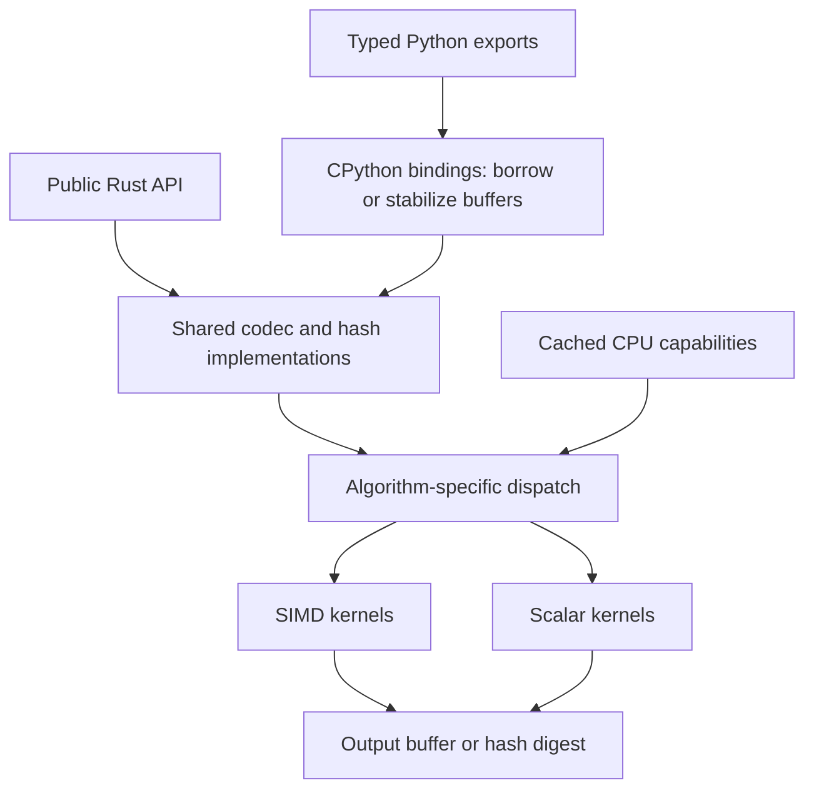
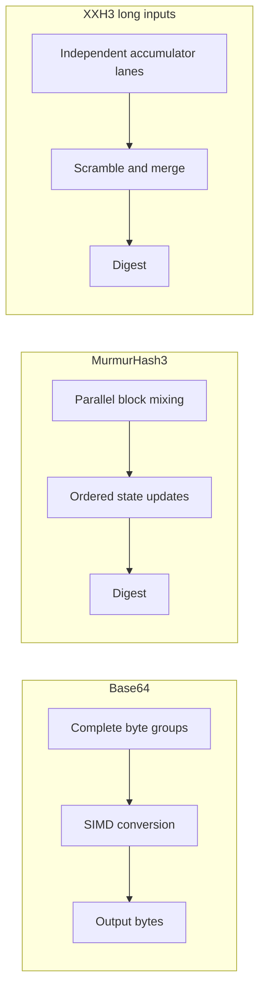

# Architecture

`hashcodecs` implements Base64, MurmurHash3, and XXH3 in Rust. It exposes the same core algorithms through a Rust
library and a CPython extension. MurmurHash3 and XXH3 provide noncryptographic hashes.

The design separates algorithm code from CPU selection, memory ownership, and Python compatibility. Rust callers
use the core without Python dependencies. Python callers use native bindings that manage objects and buffers
before calling the core.

## System structure

SIMD means single instruction, multiple data. SIMD kernels process several bytes or words per instruction.
Scalar kernels provide the portable implementation and handle work that does not suit a vector kernel.

| Component | Responsibility |
| --- | --- |
| [`src/backend.rs`][cpu] | Detect and cache CPU capabilities. |
| [`src/base64/`][base64] | Encode, decode, calculate output sizes, and select Base64 kernels. |
| [`src/murmur3/`][murmur3] | Implement hash variants, incremental state, block buffering, and kernel selection. |
| [`src/xxhash/`][xxhash] | Implement XXH3 length classes, long-input accumulation, prepared seeds, and batches. |
| [`src/bindings/`][bindings] | Parse Python arguments, manage buffers, and apply interpreter compatibility rules. |
| [`hashcodecs/`][python] | Export native functions and provide type stubs and the `py.typed` marker. |

Each algorithm exposes its Rust API through `src/<algorithm>.rs`. Internal modules contain shared logic and
architecture-specific kernels. The optional bindings share the crate with the core and can use private buffer
interfaces without allocating an intermediate Rust result.

Borrowed input and direct output avoid intermediate copies. Cached CPU detection avoids repeated hardware probes.
Batch calls share argument parsing across inputs. XXH3 batches also reuse seed setup. These choices reduce work
around the kernels.

## Public APIs and result storage

The Rust Base64 API accepts byte slices. Allocating functions create the result, while `*_into` functions write to
a mutable slice from the caller. The core checks output capacity and exposes the initialized result prefix.
Bytes beyond that prefix remain unchanged on success.

MurmurHash3 offers one-shot functions and incremental hashers. XXH3 offers one-shot functions, prepared seeds,
and batch functions. Rust batch callbacks receive digests without a result vector. Batch APIs preserve input order.

Python functions return Python objects or write into caller-managed storage through `*_into` APIs. Packed XXH3
batches store each digest in little-endian byte order. Rust XXH3-128 functions return numeric words as
`[low64, high64]`, so Rust callers choose a byte order when serializing a digest.

Output bounds and error handling form separate contracts. A failed Base64 operation can leave partial writes in
a reusable destination. Packed XXH3 batches check and stabilize their inputs before writing to the destination.
The API documentation defines the behavior of each operation.

## Algorithm design

Vector kernels share instruction and loop overhead across several input groups. Independent mixing and accumulator
operations let the CPU overlap arithmetic. Each algorithm retains its required order for dependent operations.

### Base64

Base64 separates alphabet handling, output sizing, and block conversion. SIMD kernels convert complete blocks
and check character classes during decoding. Smaller kernels or scalar code handle the remaining bytes and padding.
Encoding selects cached or streaming stores according to input size, alignment, and detected cache capacity.

The Rust API supports padded standard and URL-safe Base64. The Python binding adds custom alphabets, wrapping,
configurable validation, and lenient decoding. It applies Python compatibility rules around the shared core and
uses `binascii` for malformed cases that require CPython's exact exception behavior.

### MurmurHash3

MurmurHash3 implements the x86-32, x86-128, and x64-128 variants. SIMD kernels prepare independent input blocks
together, then apply state updates in the order that the algorithm requires.

Incremental hashers retain the hash state, total length, and incomplete block between updates. Complete blocks
pass to the selected kernel without a copy of the whole update. Finalization combines the pending bytes with
the accumulated state to produce the same digest as a one-shot call.

### XXH3

XXH3 selects formulas for short and midsize inputs. Long inputs use accumulator lanes, repeated input stripes,
and a final merge into a 64-bit or 128-bit digest. SIMD kernels implement this accumulation while preserving
the algorithm's scramble and merge rules.

`PreparedXxh3` reuses the secret derived from a seed across long-input calls. Batch APIs share seed setup and
group eligible long inputs for SIMD processing. Each input retains its own state and digest. Other inputs use
the one-shot path, with results in the original input order.

## CPU dispatch and portability

The shared backend module detects CPU features once and caches them. Each algorithm owns its selection policy
because kernel requirements and setup costs differ. Selectors check the features that both a kernel and its
fallback paths require before calling architecture-specific code.

| Operation | x86 and x86-64 preference | AArch64 preference |
| --- | --- | --- |
| Base64 | AVX-512 VBMI, AVX2, SSE4.1, SSSE3, scalar | NEON, scalar |
| MurmurHash3 | AVX2, SSE4.1, scalar, according to variant and input size | Scalar |
| XXH3 long inputs | AVX-512F, AVX2, SSSE3, scalar | NEON, scalar |

Base64 caches its selected backend and cache policy. XXH3 caches its engine for long inputs. MurmurHash3 selects
a backend for each group of complete blocks, including groups from incremental updates.

Runtime dispatch supports Intel and AMD CPUs with different instruction sets. Other architectures use scalar
code. Miri and Kani also use scalar code because their checks do not execute hardware intrinsics. Kernel selection
can depend on input size, so a call can use several kernel widths for its blocks and tail.

## Python ownership and concurrency

The bindings separate shared argument, buffer, object, and runtime policies from algorithm adapters. Native call
parsers accept positional and keyword arguments without an intermediate Python wrapper. Batch calls share this
entry cost across several inputs.

Immutable `bytes` inputs can share their storage with the Rust core. Eligible contiguous memoryviews over
immutable `bytes` retain the owner and slice bounds without an input copy. Mutable inputs require synchronization
or a snapshot, according to callbacks, overlapping output, and interpreter attachment.

Hashing and Base64 decoding flatten views that are not contiguous in C order. Base64 encoding requires input
contiguous in C order. Standard Base64 decoding can borrow an exact ASCII string's UTF-8 storage. String
subclasses retain their Python conversion behavior.

The buffer layer retains owners and stabilizes input before callbacks or output writes can invalidate a pointer.
A view that prohibits writes still follows the synchronization policy of its owner if that owner is mutable.

Short calls remain attached to the interpreter. Eligible large calls detach after securing immutable input or a
snapshot. On CPython builds with the global interpreter lock (GIL), detachment releases the GIL so other Python
threads can run. Free-threaded builds use object synchronization to protect mutable storage.

Detached packed batches stage results, then reacquire synchronization and check destination capacity before
writing those results. Native batches execute within the caller's thread. SIMD processing does not require worker
threads.

## Builds and API metadata

The Rust crate contains the production codec and hash implementations. Reference implementations and benchmark
competitors remain development dependencies. The optional `python` feature enables the bindings, and
`extension-module` adds the CPython extension configuration.

Hatchling builds the Python package and invokes the Rust extension build. CPython wheels contain the native
extension, Python exports, and type information. The source distribution includes the files needed to rebuild
the package.

[`_hashcodecs.pyi`][declarations] defines the Python declarations. The metadata generator derives Python exports,
public stubs, native signatures, and API reference lists from those declarations. Generated exports refer to native
functions without adding a Python wrapper call.

The extension and Rust benchmarks use `mimalloc` for Rust allocations. CPython manages Python object allocations.
Rust library consumers retain their allocator choice. Release and benchmark profiles use optimization level 3,
one code generation unit, and full link-time optimization.

## Correctness and verification

Kernel implementations must preserve reference outputs, CPU feature requirements, and input and output bounds.
The core initializes the returned output prefix before exposing a result. The bindings keep Python owners alive
for each borrow and prevent callbacks or concurrent mutation from invalidating that borrow.

Differential tests compare codec and hash results with reference implementations. Boundary tests exercise malformed
input, available SIMD backends, exact output slices, and incremental updates. Python tests also check conversion
order, interpreter-specific errors, overlapping buffers, and concurrency behavior.

[Memory safety verification][safety] describes the scope of Miri, Kani, fuzzing, and sanitizer checks.
[Benchmarks][benchmarks] contains measurements and reproduction commands. Algorithm guides and API references
describe call signatures and operation-specific behavior.

[benchmarks]: https://github.com/kozistr/hashcodecs-rs/blob/main/BENCHMARK.md
[cpu]: https://github.com/kozistr/hashcodecs-rs/blob/main/src/backend.rs
[base64]: https://github.com/kozistr/hashcodecs-rs/tree/main/src/base64
[murmur3]: https://github.com/kozistr/hashcodecs-rs/tree/main/src/murmur3
[xxhash]: https://github.com/kozistr/hashcodecs-rs/tree/main/src/xxhash
[bindings]: https://github.com/kozistr/hashcodecs-rs/tree/main/src/bindings
[python]: https://github.com/kozistr/hashcodecs-rs/tree/main/hashcodecs
[declarations]: https://github.com/kozistr/hashcodecs-rs/blob/main/hashcodecs/_hashcodecs.pyi
[safety]: https://github.com/kozistr/hashcodecs-rs/blob/main/SAFETY.md
