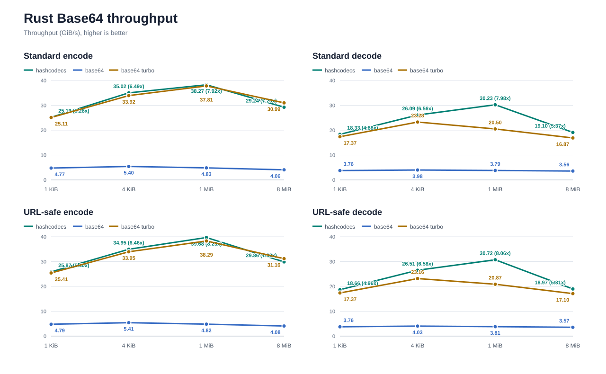
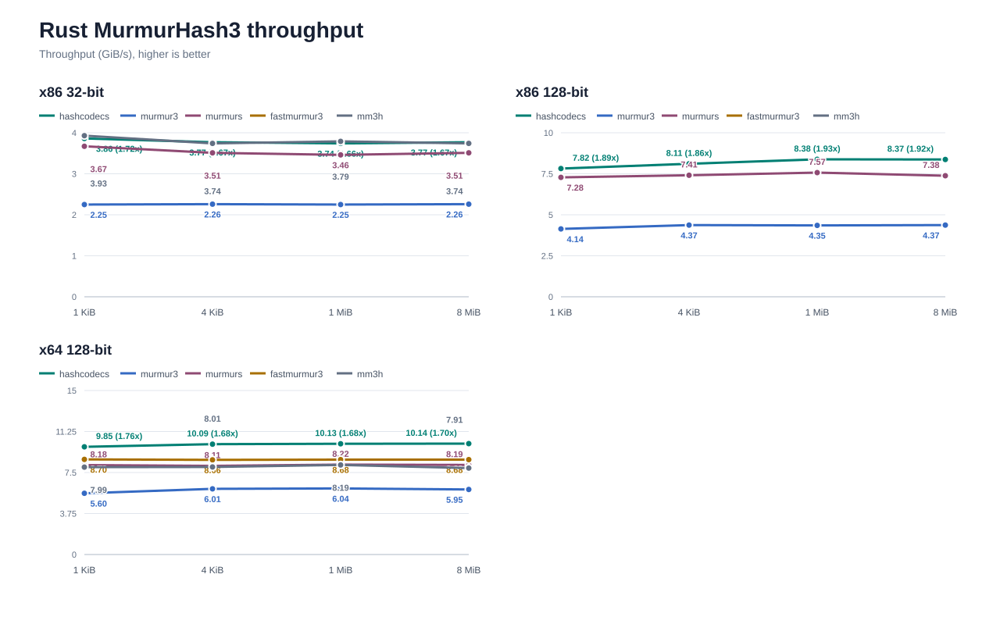
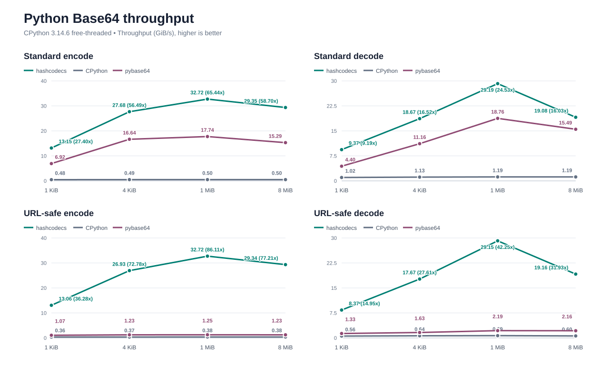
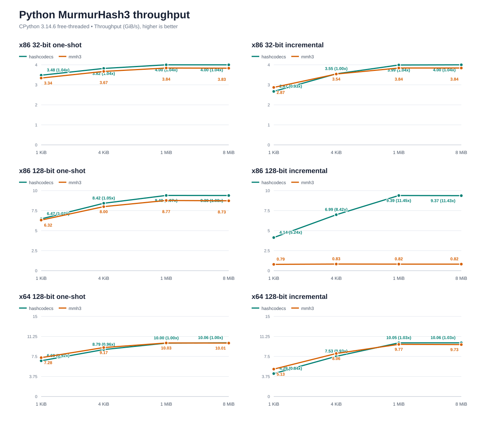

# Performance

`hashcodecs` selects the best supported implementation at runtime. On x86 and x86-64, Base64 can use AVX-512 VBMI,
AVX2, SSE4.1, or SSSE3; on AArch64 it can use NEON. MurmurHash3 and the long-input XXH3 paths similarly select
available vector backends. Every path has a scalar fallback.

The charts below were recorded on Windows 10 x64 with an Intel Core Ultra 7 265K. They include returned-output
allocation except where a reusable-buffer chart says otherwise. Higher is better.

## Rust

### Base64



### MurmurHash3



### XXH3


## Python

### Base64



### MurmurHash3



### XXH3


## Reproduce

Benchmarks pin one logical CPU, validate results before timing, and are not run in CI. Run only the relevant group
when comparing a change.

```sh
cargo bench --bench base64
cargo bench --bench murmur3
cargo bench --bench xxhash

uv sync --group benchmark --no-install-project
uv run --no-project --with . python benchmarks/python_base64.py
uv run --no-project --with . python benchmarks/python_base64_batch.py
uv run --no-project --with . python benchmarks/python_murmur3.py
uv run --no-project --with . python benchmarks/python_xxhash.py
```

The [benchmark guide](https://github.com/kozistr/hashcodecs-rs/blob/main/BENCHMARK.md) describes the full
methodology, focused modes, and interpretation notes. The corresponding raw values are available in
[results.csv](benchmarks/results.csv).
